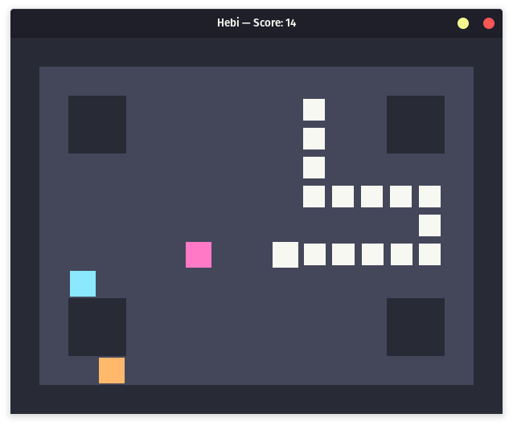

<h1 align="center">
  <br>
  
  <br>
  Hebi 🐍
  <br>
</h1>
<h4 align="center">A highly customizable snake clone made in Rust with the <a href="https://github.com/bevyengine/bevy">Bevy engine</a>, named after the Japanese word for snake, <ruby>蛇<rp>(</rp><rt>へび</rt><rp>)</rp></ruby>.</h4>

## Configuration

One of the things that sets apart Hebi from other snake clones is its rich configuration options. You can configure pretty much everything: the map, tick speed, food spawn rate, window scale, etc. You can even [make your own custom color themes](#Themes) in addition to those provided! Keep in mind that Hebi is still very much a work-in-progress, so the names, behavior, and functionality of configuration options may change in the future.

To start configuring your game, create a `config.toml` file next to the Hebi executable.

### Example `config.toml`

```TOML
theme = "solarized_light"
seed = 42
food_ticks = 8

[map]
type = "corridors"
corridor_width = 2
```

### Available configuration options

| Name                             | Type     | Default value       | Function                                                     |
| -------------------------------- | -------- | ------------------- | ------------------------------------------------------------ |
| `theme`                          | `String` | `"dracula"`         | Sets what in-game color theme Hebi should use. For example, `theme = "cavern"` would load the theme file `themes/cavern.toml`. See [Themes](#themes) for more information on creating custom themes. |
| `seed`                           | `u64`    | Random              | Sets what seed should be used for deciding snake spawn locations, food spawn locations, and food colors. Since this is an unsigned number, it must be positive and less than or equal to 18446744073709551615. |
| `map`                            | `Map`    | N/A                 | Sets the map data. See [Maps](#Maps) for more info.          |
| `grid_scale`                     | `u32`    | 36                  | Sets the number of pixels per grid square.                   |
| `tick_length`                    | `f64`    | 0.2                 | Sets the amount of time between in-game ticks in seconds. For a more challenging gameplay experience, try setting this to 0.15 or 0.1. For an easier gameplay experience for those with a slow reaction time, try setting this to 0.25 or 0.3. |
| `food_ticks`                     | `u32`    | 16                  | Sets the number of ticks between each food being spawned.    |
| `snake_spawn_segments`           | `u32`    | 2                   | Sets the number of segments the snake spawns with, including the head.<br />**💥 Modifying this option from its default value may cause the game to crash.** |
| `snake_segment_despawn_interval` | `f64`    | 0.1                 | Sets the interval between each segment despawning upon snake death in seconds. You can set this to 0 if you want the entire snake to despawn at once. |
| `snake_respawn_delay`            | `f64`    | 0.5                 | Sets the delay in seconds between all segments despawning upon snake death and respawning. |
| `eat_audio`                      | `String` | `"eat.wav"`         | Sets the audio file for the destruction of the snake's head and segments. The source for the default audio file is [jsfxr](https://sfxr.me/#57uBnWW6qLhyjpFep6TfgTpUq3NWw9QDzC57E3fRDzxMJcMxKU2Vf3cnrtwda72DFTXTh4uAyNHNaYAPEmxGmQgGoPmpNwUFEsCAGoCXU5oDzhPjzZbUiEbKm). For example, `eat_audio = "munch.wav"` (fictional file) would load the audio file `assets/sounds/munch.wav`. Both .mp3 and .wav files are supported. |
| `destroy_audio`                  | `String` | `"destroy.wav"`     | Sets the audio file for the destruction of the snake's head and segments. The source for the default audio file is [jsfxr](https://sfxr.me/#34T6PkxL9oPjLUfyMmrzX5FyQN3bbUE7cXxh6uheFgHTUxRwYULGTu1GKNxfiTvbFjRTCSCR18TaPxMnG5mJixoBHaNNgXNizga8FsaumrQ2p9uY7fDP7DXu1). |
| `spawn_food_audio`               | `String` | `"spawn_food.wav"`  | Sets the audio file for when food is spawned. The source for the default audio file is [jsfxr](https://sfxr.me/#34T6PkscYMb2dTVg4ZkS6KT3VBBapkwTVHJ1TmYSyg5EPKW3xPUZnVoPTvLjiipn53KMST3apAL6rwNLL5MdpaCeYqmTLSfwCtY6nQTF9MoQ6yzxPQmMZjFVZ). |
| `spawn_snake_audio`              | `String` | `"spawn_snake.wav"` | Sets the audio file for when the snake is spawned. The source for the default audio file is [jsfxr](https://sfxr.me/#34T6Pkiv4PXt51ecS74iabk9atWWPVcocCK1djV4oiBPiFhtgTTm9fim9UPDsAAxW2GnXAMvo69oApuqeuUx6jw4XQKJMoJfG6XQDDAhmFHHXptU9Aqe7or6A). |

## Themes

Along with the provided themes `dracula`, `solarized_dark`, `solarized_light`, and `cavern`, you can create your own themes! To get started, create a new file `my_theme.toml` in the themes folder, and open it in a text editor. To start off with, you can copy in the theme settings for `cavern`:

```TOML
walls = "222233"
background = "000011"
snake = "ddddee"
food = ["5599ff", "ffc455", "ff6f55"]
```

To change a color, replace any of the hex codes provided, and make sure to remove the leading `#`. For `food`, you can put in as many colors as you like. If you decide to only have one food color, make sure to wrap it on square brackets: `food = ["5599ff"]`.

To actually use your theme, see [Configuration](#Configuration) and add `theme` to your configuration file. If the theme can't file can't be found, the game will run, but as the colors are missing everything will be magenta. Likewise, if a color is missing or incorrectly formatted in your theme file, it will also show as magenta in-game.

## Maps

Hebi currently ships with three different map generation modes: default, corridors, and custom.

### Default

The default map type is the simplest, and it is what runs by default without any changes to the configuration file. To begin modifying, add the following to your `config.toml` file:

```TOML
[map]
type = "default"
```

To override the default generation values, see the following table.

#### Configuration options

| Name                  | Type  | Default value | Function                                                     |
| --------------------- | ----- | ------------- | ------------------------------------------------------------ |
| `width`               | `u32` | 17            | Sets game grid width, including walls.                       |
| `height`              | `u32` | 13            | Sets game grid height, including walls.                      |
| `corner_walls`        | `u32` | 2             | Sets the width and height of the corner walls. If you don't want any corner walls and an empty map, just set this to 0. |
| `corner_walls_offset` | `i32` | 2             | Sets the offset on the x- and y-axes of each of the corner walls from their respective corners of the map. |

### Corridors

The corridors map type is the only (relatively) complex generation type in the game currently. It sets up a bunch of vertical (or horizontal) corridors in the map of varying heights to increase game difficulty. To begin modifying add the following to your `config.toml` file:

```TOML
[map]
type = "corridors"
```

To override the default generation values, see the following table.

#### Configuration options

| Name                     | Type   | Default value | Function                                                     |
| ------------------------ | ------ | ------------- | ------------------------------------------------------------ |
| `width`                  | `u32`  | 34            | Sets game grid width, including walls.                       |
| `height`                 | `u32`  | 17            | Sets game grid height, including walls.                      |
| `horizontal`             | `bool` | false         | Sets whether to generate the map horizontally instead of vertically. |
| `corridor_width`         | `u32`  | 3             | Sets the width (height if `horizontal = true`) of each corridor. Corridors at the end of the map may be wider. This shouldn't be set to less than 2, since 1-wide corridors are dead ends and cannot be exited by the snake. |
| `corridor_height`        | `u32`  | 10            | Sets the maximum height (width if `horizontal = true`) of each corridor. For more control, see `wall_variance`. |
| `top_corridor_offset`    | `i32`  | 3             | Sets the horizontal (vertical if `horizontal = true`) offset of the top row of corridors. |
| `bottom_corridor_offset` | `i32`  | 0             | Sets the horizontal (vertical if `horizontal = true`) offset of the bottom row of corridors. |
| `wall_variance`          | `f32`  | 0.5           | Sets the variance in the height (width if `horizontal = true`) of each wall. For example, with the default values where `corridor_height = 10` and `wall_variance = 0.5`, that means that the actual heights of the walls in-game can vary anywhere in the top 50% of the maximum height, e.g. anywhere from 5 to 10. |

### Custom

If you aren't satisfied with the provided map generators, you can make your own maps! To get started, add the following to your `config.toml` file:

```toml
[map]
type = "custom"
data = """
#################
#               #
#  >      >  <  #
#  #      #  #  #
#  #      #  #  #
#               #
#  > <   >      #
#  # #   #      #
#  # #   # ##v  #
#               #
#################
"""
```

In the `data` field is where you make your map. A space means empty space and a pound sign `#` means a wall. Additionally, you must place at least one snake spawn point. A power symbol (`^`) is an up-facing spawn, a lower-case V (`v`) is down-facing spawn, a less-than sign (`<`) is a left-facing spawn, and a greater-than sign (`>`) is a right-facing spawn.

## Contributing

If you feel like there's something you'd like to add to the game, feel free to make a fork and submit a pull request! I'll try to review it as soon as possible. If there's an issue with how I've structured the code in the project and you feel like there's a better way, however, please make an issue instead. Hebi is a learning project for me to learn Rust and Bevy, and I'd like to implement most of the core changes myself.

If you want to create a custom map generation type, a good starting point would be looking at `src/maps/default.rs`. Once you've got your generator working, submit it with a pull request! The more variety in game maps the better.


## Building from source

Do you like what you see? Or maybe, you'd like to contribute to the project?

If you answered "Yes", then follow through these steps to get the game up and running, built right from source. 

If you don't have Rust installed already, see [the installation guide on Rust's official website](https://www.rust-lang.org/tools/install) and then come back once you're done.

Before we get to work, please note that Hebi uses some nightly Rust features ([`strip`](https://github.com/johnthagen/min-sized-rust#strip-symbols-from-binary), which is one of the features used to create smaller binary sizes), that haven't been introduced to the stable channel. If you want to build Hebi without nightly Rust, remove or comment out the lines `cargo-features = ["strip"]` from the top and `strip = true` under `[profile.release]` in `Cargo.toml`.

1. Don't mind installing the channel? Then, let's default to it. If it's not already installed, then `rustup` will take care of that for you:

```bash
rustup default nightly
```

2. Now, clone the repository:

```bash
git clone https://github.com/ElnuDev/hebi.git
```

3. Great, let's jump inside the directory:

```bash
cd hebi
```

4. Okay, let's proceed by building the game; you know, turning that _code_ into an _executable_.

- If you plan on contributing towards Hebi, we recommend building without the `--release` flag to cut down on compilation time:

```bash
cargo build
```

- If you're ready to take your Snake game to the next level and want the best experience, then `--release` is your friend:

```bash
cargo build --release
```

5.  Now that you've built it yourself, you might want to [configure Hebi](#configuration).

### [Compressing with `upx`](https://github.com/johnthagen/min-sized-rust#compress-the-binary)

The Linux and Windows (gross) builds provided in the [releases](https://github.com/ElnuDev/hebi/releases) section are compressed with [UPX](https://github.com/upx/upx), the **U**ltimate **P**acker for e**X**ecutables. UPX can reduce the binary size of Hebi by around 75%. If you want to make a distributable build of Hebi and have already used the `--release` flag for `cargo build`, you may also want to consider UPX. The cons of using UPX is that Hebi may be more likely to be flagged as malware by antivirus software, and there could be a performance penalty (unconfirmed, though it doesn't really matter much for such a simple game).

1. Install UPX

If you're on a Debian-based Linux distribution, you can install it with `apt`:

```bash
sudo apt install upx
```

If you're on Windows, you can download it from the UPX GitHub repository's [releases section](https://github.com/upx/upx/releases). To my knowledge, it's not available for `winget`, Window's new package manager, just yet.

2. Compress the binary

Ensure you're in the cloned Hebi folder first.

Linux:

```bash
upx --best --lzma target/release/hebi
```

Windows:

```shell
path\to\upx.exe --best --lzma target\release\hebi.exe
```

### Distribution

For distribution, make sure to include the executable (`hebi` on Linux, `hebi.exe` on Windows) next to the `themes` and `assets` folder.
